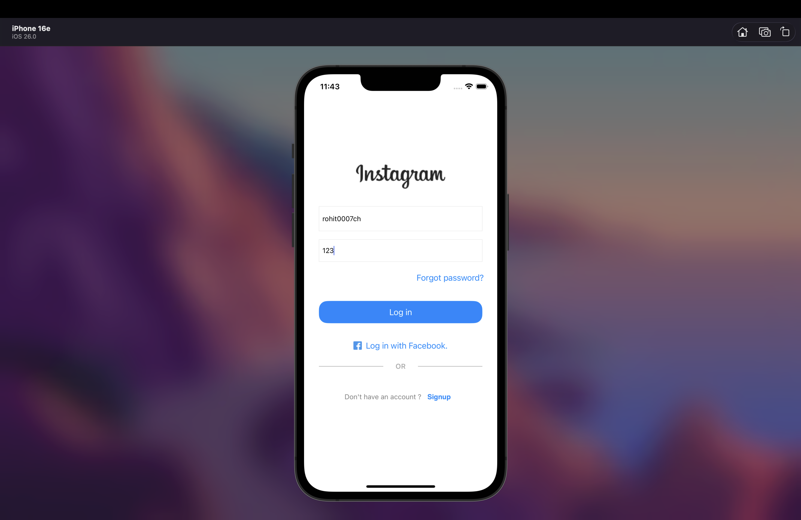
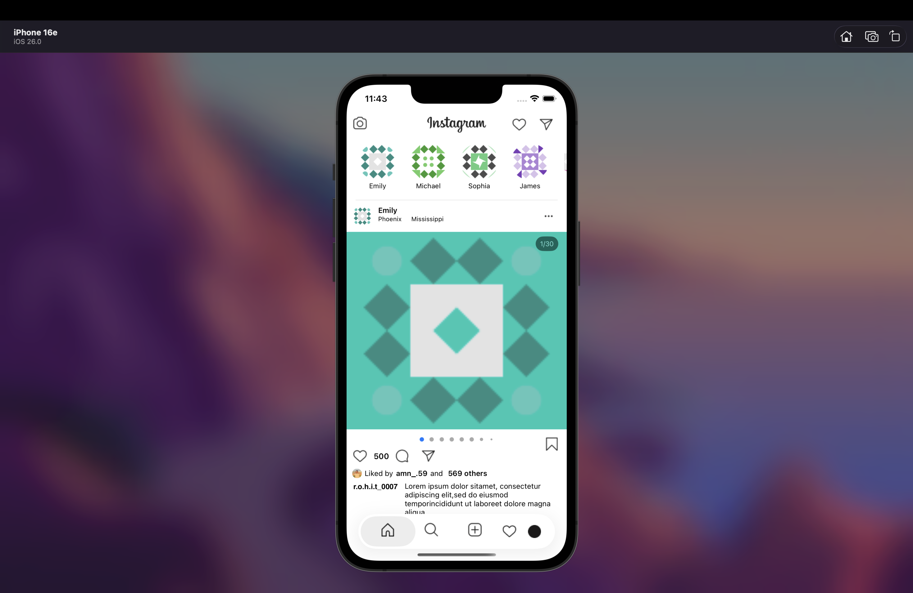
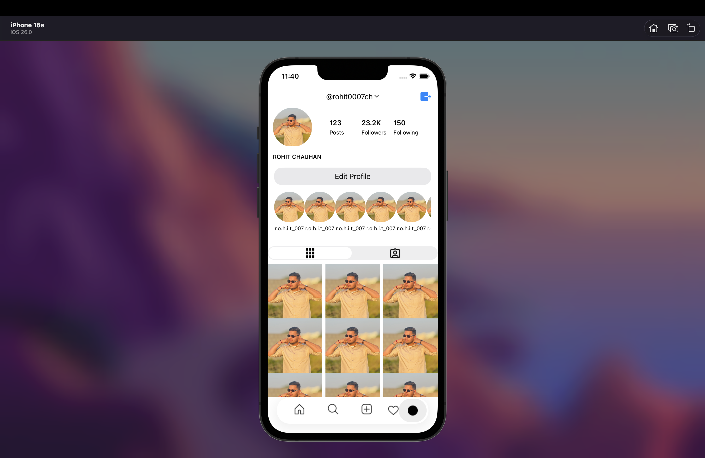

# 📱 InstagramClone

An Instagram-like social media app built with **Swift** and **UIKit**, featuring API integration, user authentication, and Core Data persistence.  
Designed to deliver a clean, responsive, and smooth user experience similar to Instagram.

---

## 🧩 Features

- 👤 **User Authentication:** Login & registration using Core Data  
- 🖼️ **Dynamic Feed:** Fetches posts and user data from RESTful APIs  
- 📸 **Image Picker:** Upload photos using `UIImagePickerController`  
- 🎨 **Modern UI:** Fully responsive layout with Auto Layout & UIKit  
- 🧱 **Offline Storage:** Core Data used to cache user data

---

## 🖥️ Screenshots

| Login Screen | Feed Screen | Profile Screen |
|---------------|-------------|----------------|
|  |  |  |

> *Screenshots stored inside `/screenshots` folder*

---

## 🛠️ Tech Stack

- **Language:** Swift 5  
- **Framework:** UIKit  
- **Architecture:** MVC  
- **Database:** Core Data  
- **Networking:** URLSession / API Fetching  
- **UI:** Auto Layout
---

## 🚀 How to Run

1. Clone the repo  
   ```bash
   git clone https://github.com/rohit0007ch/InstagramClone.git


## 🧑‍💻 Author

**Rohit** — iOS Developer  
📧 rohit@example.com  
🌐 [Portfolio Website](https://rohit0007ch.github.io)
